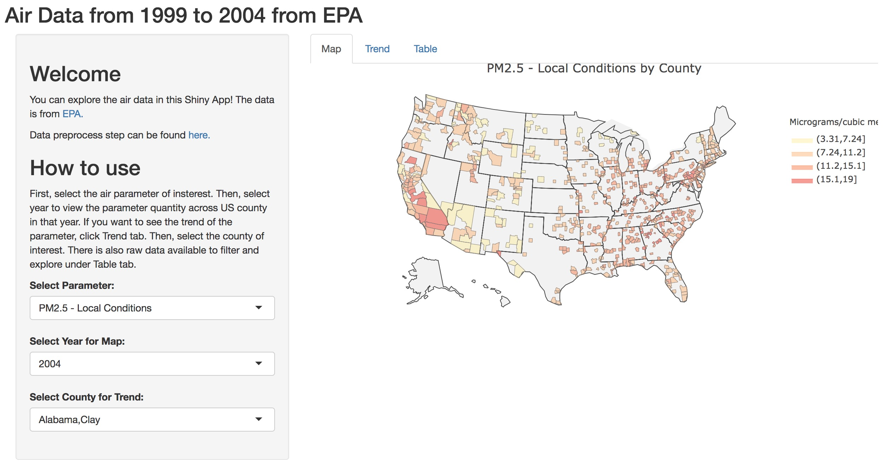
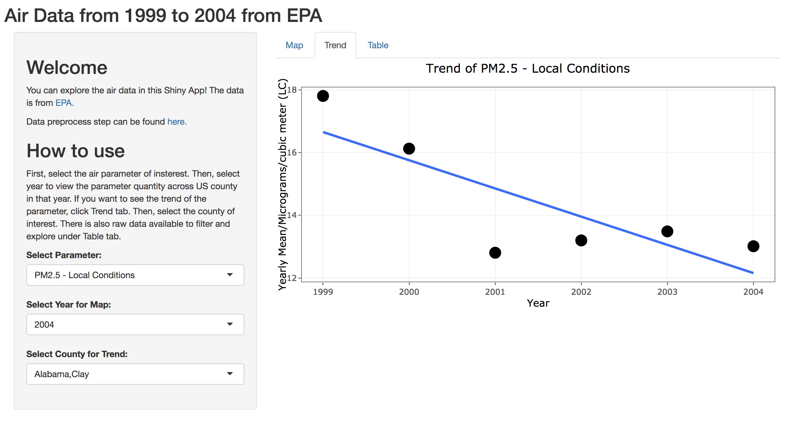
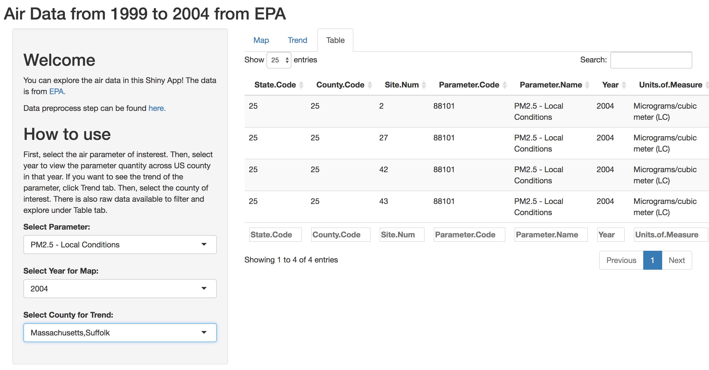

```{r setup, include=FALSE}
knitr::opts_chunk$set(echo = TRUE)
library(plotly)
library(tidyverse)
library(maps)
library(sp)
library(rgdal)
library(ggplot2)
library(maptools)
library(mapproj)
```

### Learning Goals
- Apply skills acquired in task analysis, design space exploration, and software implementation for a data visualization projects.
- Create a Shiny app for interactive, exploratory visualization of a complex, heterogeneous data set.

### Step 1: Identify a data set and visualization tasks
#### 1. Identify a data set of interest for your visualization project.  
The data set of interest is the annual air quality data collected at outdoor monitors across the US.  
Source: https://aqs.epa.gov/aqsweb/airdata/download_files.html

#### 2. Describe what kind of information can be derived through exploratory visualization analysis of the data set.  
To explore the trend of air pollutants across years and compare the trend of individual pollutant.

#### 3. Identify the target audience for the visualization tool that you will build.  
The target audience would be anyone interested in the air quility and specific pollutants in the US. They could be researchers with expert knowledge or anyone without previous experience in the field.

#### 4. Develop a list of visualization tasks for the data set.  
A. Visualize the mean quantity of the pollutant (user choose) in a year at outdoor monitors across the US on a US map.  
B. Visualize the scatter plot of the mean quantity of individual pollutants vs years.  
C. Visualize the heatmap of the mean quantity of all pollutants across years.  
D. Visualize the distribution of all pollutants in a year or in multiple years.  

#### 5. Describe the data types present in your data set (temporal, networks, multivariate matrices, etc.).  
Multivariate data including categorical, numerical, geographical, binary and date.  

### Step 2: Apply Five Design Sheet Methodology
#### 1. Apply Five Design Sheet Methodology.  


#### 2. Describe potential visualization challenges.  
Some visaulization challenges include the implementation of the shiny app, data preprocessing, and the layout of the whole visualization.  
Note that your design may go beyond what you will actually implement in your Shiny app.

### Step 3: Describe Implementation Strategy
#### Write a short paragraph describing how you are planning to implement your application and how different components of your visualization will be interacting with each other.   
The shiny app will have two parts: one sidebar panel with controls and one main panel with three plots. The sidebar panel will have two sets of controls. The first set of controls is for the map, which includes one select input that selects years, one radia button that selects region, and one select input thtat selects pollutants. The second set of controls is for the distribution plot, which includes one multiple select input that selects and deselects region, and another multiple selection input that selects and deselects years. The three plots in the main panel are a US map, a distribution, and a trend line plot. When mouse hovering on the map, it will show the distribution of the pollutant in the region of the year. When clicking on the map, the distribution locks in and there will be a trend plot added for the pollutant in the region. Users can change the region, year, and pollution by side bar panel. They can click the map again, and a new distribution will add to the distribution if the same pollutant, and a new trend line will be added below the previous trend plot.  

### Step 4: Implement Shiny Application 
#### Implement your application using R, Shiny and Plotly. You may also create static ggplot2 visualizations in exceptional cases (e.g. if there is no appropriate Plotly plot available for your data).
See https://dongchenhms.shinyapps.io/AirData1999-2004/.


### Step 5: Prepare and Present a Live Demo 
#### 1. Describe your data set.
a. Why was the data collected?  
The data is collected by EPA. The mission of EPA is to protect human health and the environment. The data is collected to ensure clean air and reduced environmental risks are based on the best available scientific information. AirData assists a wide range of people, from the concerned citizen who wants to know how many unhealthy air quality days there were in his county last year to air quality analysts in the regulatory, academic, and health research communities who need raw data.

b. How was it collected?  
The AirData is collected at outdoor monitors across the United States, Puerto Rico, and the U.S. Virgin Islands. The data comes primarily from the AQS (Air Quality System) database.  

c. What are the characteristics of the data?  
The data is multivariate and includes 55 variables with over 60,000 observations in each file. My visualization only need observations with “sample duration” of 24 hour. And it needs variables state code, county code, site number, parameter code, parameter name, year, units, mean, state name, county name.
I also removed duplicated site number for the same parameter, state code, and county code. Since duplicated measures are just based on different measuring methods, so the measurement values are the same.  

#### 2. Provide rationale for a visual exploration tool.
a. Why is a visualization tool necessary?  
Visualization of the air data makes eaiser to observe the overall pattern of the air parameter either across US or across multiple years.  

b. What can we expect to learn?  
The users can expect to learn the quantity of the selected air parameter on the county level of details in a year. They can also expect to learn the trend of the selected air parameter in the selected county across multiple years.  

#### 3. Discuss your final design and justify your design decisions.
a. Why did you choose your visual encodings?  
First, a map is a general and easy way for people to observe the pattern of data with locations. (Fig 1) Using color to encoding the quantity of measurement is a straightforward way but will loss some level of details. So the table of the data of selection is available to view the details of the data. (Fig 2) A trend map is used to visualize the trend of selected parameter. The title and axis will automatically update the selected choices. A linear model fitting line is added to predict the trend. (Fig 3)  

  


  


  


b. What kind of interactions did you implement and why?  
I would like to make the visaulization as simple as possible for the users to operate while having the desired functions. So the interactions I implemented are three multiple selections and three tabs to choose. User can also hover on the plot to see the details of the data.  

c. Does your visualization scale with the size of the data?  
The color encoding on the map plot used discrete scale where the parameter quantities are divided into 5 groups from the maximum to the minimum. Lower intensity of the color encodes the group with lower quantity of measurements.  

#### 4. Provide a live demo that illustrates key features of your Shiny app  

#### 5. Future improvements:
a. Highlight the selected county or auto zoom on the selected county on map plot.  
b. Add a histogram of the selected parameter.  
c. Incorporate all years of data til 2018 and add visaulization on observations with “sample duration” besides 24 hour.  
d. Time series prediction analysis on the trend plot to make prediction of the future air parameter quantity.  

### Preprocessed data looks like below, data from 1999 to 2004 will be use

```{r}
# only read in first 200 rows for testing purpose
datfile <- "https://raw.githubusercontent.com/chendong94/BMI706-Visaulization-for-Biomedical-Application/master/Project/airdata.csv"
testdat <- read.csv(datfile ,stringsAsFactors = F,nrows = 200)
str(testdat)
```


Reference: http://www.grroups.com/blog/r-plotting-heat-map-choropleth-on-us-county-level-map-using-ggplot2

