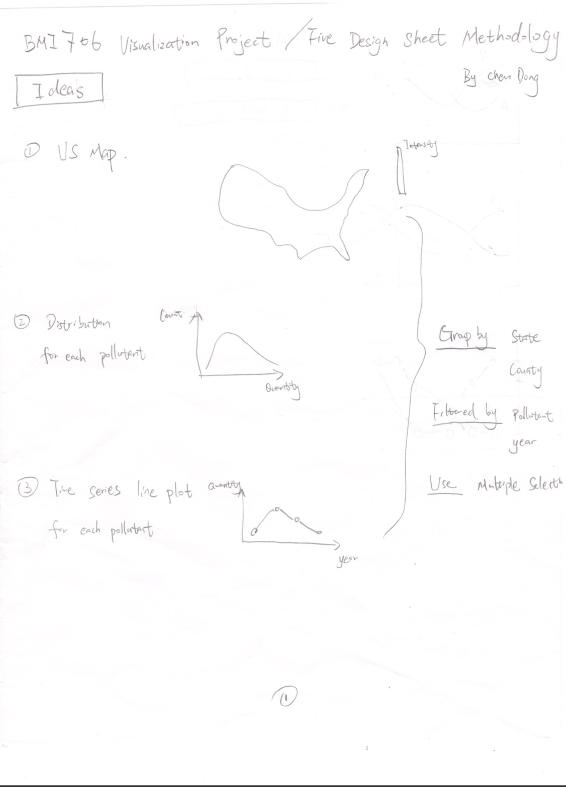
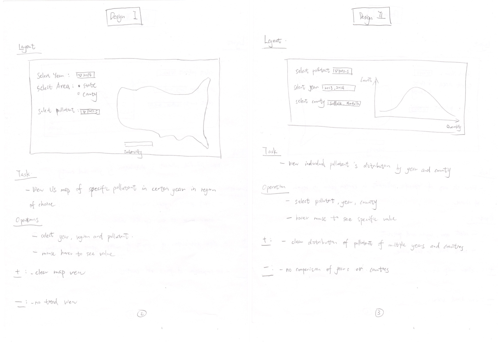
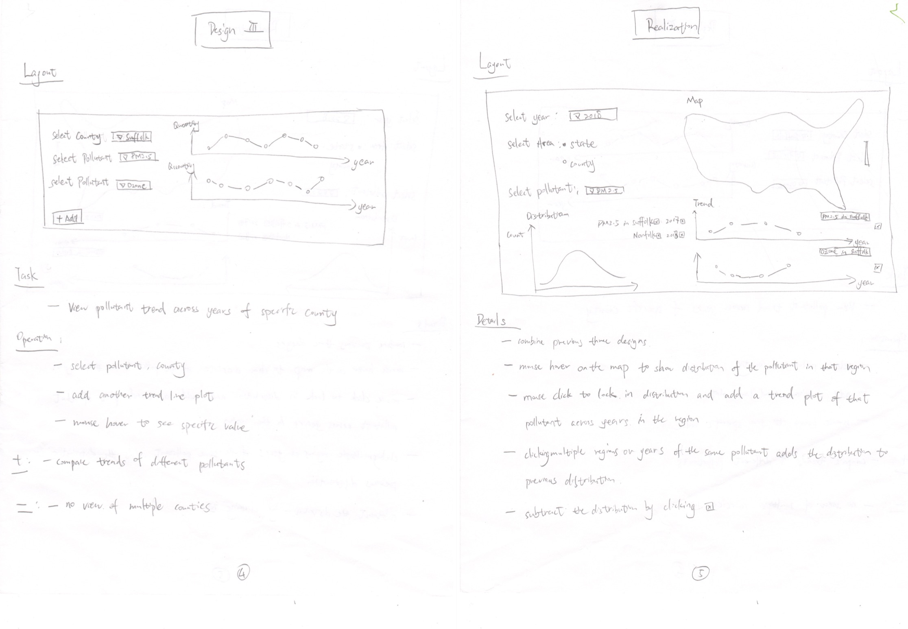

```{r setup, include=FALSE}
knitr::opts_chunk$set(echo = TRUE)
library(plotly)
library(tidyverse)
library(maps)
library(sp)
library(rgdal)
library(ggplot2)
library(maptools)
library(mapproj)
```

### Learning Goals
- Apply skills acquired in task analysis, design space exploration, and software implementation for a data visualization projects.
- Create a Shiny app for interactive, exploratory visualization of a complex, heterogeneous data set.

### Step 1: Identify a data set and visualization tasks (due 4/19)
1. Identify a data set of interest for your visualization project.  
The data set of interest is the annual air quality data collected at outdoor monitors across the US.  
Source: https://aqs.epa.gov/aqsweb/airdata/download_files.html

2. Describe what kind of information can be derived through exploratory visualization
analysis of the data set.  
To explore the trend of air pollutants across years and compare the trend of individual pollutant.

3. Identify the target audience for the visualization tool that you will build.  
The target audience would be anyone interested in the air quility and specific pollutants in the US. They could be researchers with expert knowledge or anyone without previous experience in the field.

4. Develop a list of visualization tasks for the data set.  
A. Visualize the mean quantity of the pollutant (user choose) in a year at outdoor monitors across the US on a US map.  
B. Visualize the scatter plot of the mean quantity of individual pollutants vs years.  
C. Visualize the heatmap of the mean quantity of all pollutants across years.  
D. Visualize the distribution of all pollutants in a year or in multiple years.  

5. Describe the data types present in your data set (temporal, networks, multivariate
matrices, etc.).  
Multivariate data including categorical, numerical, geographical, binary and date.  

### Step 2: Apply Five Design Sheet Methodology (4/26)
1. Apply Five Design Sheet Methodology.  







2. Describe potential visualization challenges.  
Some visaulization challenges include the implementation of the shiny app, data preprocessing, and the layout of the whole visualization.  
Note that your design may go beyond what you will actually implement in your Shiny app.

### Step 3: Describe Implementation Strategy (due 4/26)
Write a short paragraph describing how you are planning to implement your application and how different components of your visualization will be interacting with each other.   
The shiny app will have two parts: one sidebar panel with controls and one main panel with three plots. The sidebar panel will have two sets of controls. The first set of controls is for the map, which includes one select input that selects years, one radia button that selects region, and one select input thtat selects pollutants. The second set of controls is for the distribution plot, which includes one multiple select input that selects and deselects region, and another multiple selection input that selects and deselects years. The three plots in the main panel are a US map, a distribution, and a trend line plot. When mouse hovering on the map, it will show the distribution of the pollutant in the region of the year. When clicking on the map, the distribution locks in and there will be a trend plot added for the pollutant in the region. Users can change the region, year, and pollution by side bar panel. They can click the map again, and a new distribution will add to the distribution if the same pollutant, and a new trend line will be added below the previous trend plot.  


### Preprocessed data looks like below, data from 1999 to 2004 will be use

```{r}
# only read in first 200 rows for testing purpose
testdat <- read.csv("airdata.csv",stringsAsFactors = F,nrows = 200)
str(testdat)
```


```{r, echo=FALSE, warning=FALSE}

sd3 <- lst %>% na.omit() %>% SharedData$new()

g <- list(
  showframe = F,
  showcoastlines = T,
  showland = T,
  landcolor = toRGB("grey"),
  projection = list(type = 'Mercator')
)

p7 <- plot_geo(sd3) %>% 
  add_trace(z=~count,color = ~count, colors = 'Blues', text = ~country, locations = ~code, 
            marker = list(line = list(color = toRGB("grey"), width = 0.5))) %>%
  colorbar(title = "Flu Cases") %>%
  layout(
    title = 'Flu Cases',
    geo = g
  )

bscols(
  widths=c(3,9),
  list(
    filter_checkbox('continent', 'Continent', sd3, ~continent ),
    filter_select('week','Week',sd3,~week,multiple = F)),
  p7) 
```


```{r, include=FALSE}
unemp <- read.csv("http://datasets.flowingdata.com/unemployment09.csv")
names(unemp) <- c("id", "state_fips", "county_fips", "name", "year", 
                  "?", "?", "?", "rate")
unemp$county <- tolower(gsub(" County, [A-Z]{2}", "", unemp$name))
unemp$state <- gsub("^.*([A-Z]{2}).*$", "\\1", unemp$name)
county_df <- map_data("county")
names(county_df) <- c("long", "lat", "group", "order", "state_name", "county")
county_df$state <- state.abb[match(county_df$state_name, tolower(state.name))]
county_df$state_name <- NULL
state_df <- map_data("state")
choropleth <- merge(county_df, unemp, by = c("state", "county"))
choropleth <- choropleth[order(choropleth$order), ]
choropleth$rate_d <- cut(choropleth$rate, breaks = c(seq(0, 10, by = 2), 35))

# provide a custom tooltip to plotly with the county name and actual rate
choropleth$text <- with(choropleth, paste0("County: ", name, "Rate: ", rate))
p <- ggplot(choropleth, aes(long, lat, group = group)) +
  geom_polygon(aes(fill = rate_d, text = text), 
               colour = alpha("white", 1/2), size = 0.2) + 
  geom_polygon(data = state_df, colour = "white", fill = NA) +
  scale_fill_brewer(palette = "PuRd") + theme_void()
# just show the text aesthetic in the tooltip
ggplotly(p, tooltip = "text")
```

```{r}
ggplot(mergedata, aes(long, lat, group = group)) +
  geom_polygon(aes(fill = mean, text = NA), 
               colour = alpha("white", 1/2), size = 0.2) + 
  geom_polygon(data = state_df, colour = "white", fill = NA) +
  scale_fill_brewer(palette = "PuRd") + theme_void()
```


```{r, include=FALSE}
mapcounties <- map_data("county")
mapstates <- map_data("state")
counties <- map('county', fill=TRUE, col="transparent", plot=FALSE)
IDs <- sapply(strsplit(counties$names, ":"), function(x) x[1])
counties_sp <- map2SpatialPolygons(counties, IDs=IDs,
proj4string=CRS("+proj=longlat +datum=WGS84"))
pointsSP <- SpatialPoints(testdat[c("Longitude","Latitude")],
                          proj4string=CRS("+proj=longlat +datum=WGS84"))
indices <- over(pointsSP, counties_sp)

countyNames <- sapply(counties_sp@polygons, function(x) x@ID)
testdat$county <- countyNames[indices]
mapcounties$county <- with(mapcounties , paste(region, subregion, sep = ","))

# Aggregate our data at County Level (it was earlier aggreated at zipcode level)

testdat.mean <- testdat %>% 
  group_by_at(vars(Year,Parameter.Name,county)) %>% 
  summarise(mean = mean(Arithmetic.Mean))

# Remove any duplicate records

mydata.un<-testdat[!duplicated(testdat[c("county")]),]

# Merge the unique County list with the aggregated record list to get the final list 

mydata.final=merge(testdat.mean,mydata.un,by.x='county',by.y = 'county')

# Initialise the ColorBucket to divide the count and and use it for distributing colors for the heat-map

mydata.final$colorBuckets <- as.factor(as.numeric(
  cut(mydata.final$mean,
      breaks = seq(0, max(mydata.final$mean), by = max(mydata.final$mean) / 5)
      )))

# Merge our data with all US counties data

mergedata <- merge(mapcounties, mydata.final, by.x = "county", by.y = "county")

# Arrange the Data in sorted order of Counts (this step may be removed)

#mergedata <- mergedata[order(mergedata$counts),]

# Now plot the data on a map using ggplot function from ggplot2 package

map <- ggplot(mergedata, aes(long,lat,group=group)) + geom_polygon(aes(fill=colorBuckets))
map <- map+theme(panel.background = element_rect(fill = "white"))
map <- map + scale_fill_brewer(palette="PuRd") + 
  coord_map(project="globular")
map <- map + geom_path(data = mapstates, colour = "black", size = .3)
map <- map + geom_path(data = mapcounties, colour = "black", size = .5, alpha = .1)
map
```


```{r, include=FALSE}
blank_layer <- list(
  title = "",
  showgrid = F,
  showticklabels = F,
  zeroline = F)


df <- read.csv("https://raw.githubusercontent.com/bcdunbar/datasets/master/californiaPopulation.csv")

cali <- map_data("county") %>%
  filter(region == 'california')

pop <- df %>%
  group_by(County.Name) %>%
  summarise(Pop = sum(Population))

pop$County.Name <- tolower(pop$County.Name) # matching string

cali_pop <- merge(cali, pop, by.x = "subregion", by.y = "County.Name")

cali_pop$pop_cat <- cut(cali_pop$Pop, breaks = c(seq(0, 11000000, by = 500000)), labels=1:22)


geo <- list(
  scope = 'usa',
  showland = TRUE,
  landcolor = toRGB("gray95"),
  countrycolor = toRGB("gray80")
)

p <- cali_pop %>%
  group_by(group) %>%
  plot_geo(
    x = ~long, y = ~lat, color = ~pop_cat, colors = c('#ffeda0','#f03b20'),
    text = ~subregion, hoverinfo = 'text') %>%
  add_polygons(line = list(width = 0.4)) %>%
  add_polygons(
    fillcolor = 'transparent',
    line = list(color = 'black', width = 0.5),
    showlegend = FALSE, hoverinfo = 'none'
  ) %>%
  layout(
    title = "California Population by County",
    geo = geo)

p

# # Create a shareable link to your chart
# # Set up API credentials: https://plot.ly/r/getting-started
# chart_link = api_create(p, filename="county-level-geo")
# chart_link
```


Reference: http://www.grroups.com/blog/r-plotting-heat-map-choropleth-on-us-county-level-map-using-ggplot2

Time series prediction analysis